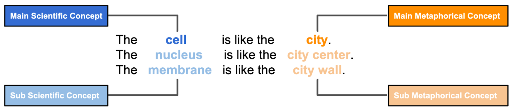

# Extended Metaphor Dataset

<!-- 

 -->



## Overview

We introduce a dataset of extended metaphors for science writing. It contains 600 extended metaphors that consist of 4,255 simple metaphors. The metaphors span six scientific domains, three levels of difficulty, and four transformer models. The details are like the below.

* Scientific Domains: Astronomy, Biology, Chemistry, Computer Science, Earth Science, Physics.
* Levels of Difficulty: Elementary (elementary school level), Intermediate (middle and high school level), Advanced (college level)
* Transformer Models: GPT-3 (0-shot vanilla, 10-shot vanilla, 0-shot with augmented prompt, 10-shot with augmented prompt), GPT-2, XLNet, and RoBERTa. 

The ratings for metaphors were collected from six professional science writers. We collected ratings from three writers for a single metaphor considering the subjectivity of metaphor evaluation. The evaluation criteria for vehicle and mapping are like the below, respectively.

### Vehicle

* Originality: The metaphor is unique and novel.
* Metaphoricity: The metaphor is metaphoric (i.e., not literal).
* Validity: The metaphor is valid overall. It performs a role as a scientific metaphor explaining the scientific concept in a more understandable and relatable way.
* Relevance to main metaphor: The sub-metaphors are relevant to the main metaphor.
* Coherence of sub-metaphors: The sub-metaphors are coherently and closely connected to each other.
* Willingness to adopt: I'm willing to use this metaphor for my writing.
* Inspirational effect: The metaphor example will inspire me to create metaphors.

### Mapping
 
* Fluency: The metaphor is fluent, grammatical, and easy to understand.
* Scientific Precision: The reasons for the metaphor explain the scientific concepts precisely.
* Relatedness: The reasons for the metaphor closely connect the scientific concepts and metaphorical concepts.
* Validity: The reasons for the metaphor are valid overall. They perform a role as a scientific metaphor explaining the scientific concept in a more understandable and relatable way.
* Willingness to adopt: I'm willing to use this metaphor for my writing. 
* Inspirational effect: The metaphor example will inspire me to create metaphors.


## Files
* metaphor_data.csv: 600 extended metaphors that consist of 4,255 simple metaphors
* rating_vehicle.csv: professional writers' ratings on vehicles of metaphors
* rating_mapping.csv: professional writers' ratings on mappings of metaphors
* concepts_per_domain.csv: mapping between the scientific domains and scientific concepts

## Licensing

Labels are licensed under Creative Commons Attribution 4.0 License

## Contact

This section will be added after the blind review process.

## Citations

```
Jeongyeon Kim, Sangho Suh, Lydia Chilton, and Haijun Xia. "Metaphorian: Leveraging Large Language Models to Support Extended Metaphor Creation for Science Writing." In Designing Interactive Systems Conference, pp. 41-57. 2023.
```

```
@inproceedings{kim2023metaphorian,
  title={Metaphorian: Leveraging Large Language Models to Support Extended Metaphor Creation for Science Writing},
  author={Kim, Jeongyeon and Suh, Sangho and Chilton, Lydia and Xia, Haijun},
  booktitle={Designing Interactive Systems Conference},
  pages={41--57},
  year={2023}
}
```
